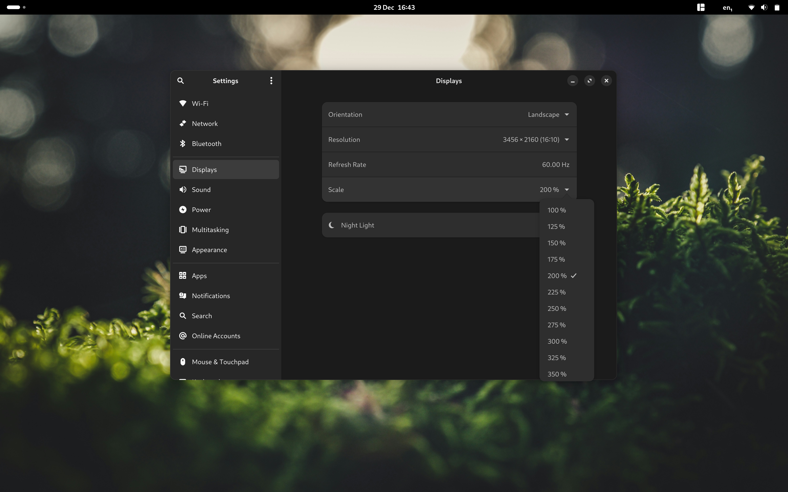
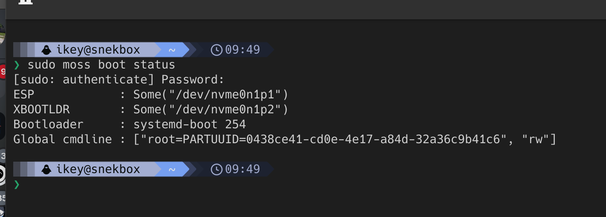
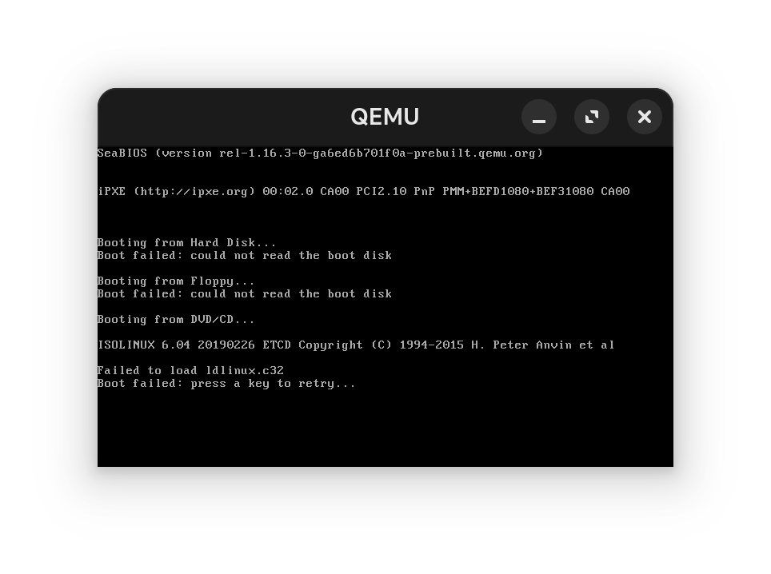
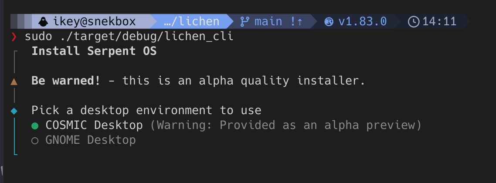

+++
title = 'Alpha Refresh Available'
date = 2024-12-29T16:45:48Z
+++

In response to feedback from the community, we're issuing a refresh of the Alpha 1 release, `0.24.6`. This refresh includes a number of key updates and improvements, including:

 - Now works with etcher
 - Fractional scaling enabled by default
 - Prebuild icon theme caches to speed up trigger execution (except for `hicolor`)
 - Add new `moss boot status` command for introspection into [blsforme](https://github.com/serpent-os/blsforme) functionality
 - Fix amdgpu initialisation for older devices, previously leading to black screen on boot

## Clarification on moss boot management

Frequently in Team Serpent we joke that `moss` is the "systemd of package managers". It actually does a whole lot more than is easily visible.. for example:

 - Content addressable storage for the entire OS
 - Atomic updates of `/usr` by `renameat2()` w/ `RENAME_EXCHANGE`
 - Executes **transactional triggers** in a namespace (container) with RW `/usr` and RO binds of `/etc` and `/var` ...
 - Executes **system triggers** postblit, with dependency ordering..
 - Via blsforme, manages the ESP, XBOOTLDR, boot entries, sync and promotion of bootloader, kernel and assets, initrds..
 - Entirely zero configuration. No `/etc/default/grub`, no remembering your `root={}`, its determined automatically.
 - Basically does all the work of OS provisioning, barring disk mounting and partitioning. Lichen is basically a thin wrapper of moss.

We've had no debugging capabilites around the boot management, so we've landed `moss boot status` command. It's super primitive
but does offer an insight into the introspection capabilites of blsforme. In this simple screenshot, moss/blsforme are supporting the
Boot Loader Protocol, querying the `systemd-boot` entries in efivars. When found, `LoaderDevicePartUUID` is used to determine the
boot ESP, but moss/blsforme will quite happily read the GPT directly (relative to `/` mount) and find the ESP and XBOOTLDR...

Remember - we happily use `systemd-boot`. We do not use `bootctl` or `kernel-install`. Entries are automatically managed and
we're extending this to support offline rollbacks via boot menu (feel free to extend with `/etc/kernel/cmdline.d/*.cmdline` drop-in snippets!)
Also note we do not allow systemd to automount the ESP or XBOOTLDR via the GPT autogenerator, instead moss/blsforme will automatically
discover and if necessary, mount these partitions, when dealing with bootloader or kernel updates.

With this explicit control over the boot management, we'll happily be landing secure boot and fwupd support in the near future,
without the downsides of trying to provide EFI assets to `/boot` in a package itself. 😬

## A note on virtual machine usage

It must be clearly stated that Serpent OS does not support anything other than UEFI booting on x86_64-v2+ capable hardware.
Please note that GNOME Boxes will default to BIOS, not UEFI, and will need hand-mangling of the XML file. Also note in other
solutions such as VirtualBox you will need to specifically select `EFI` in the VM settings.

In order to maximise compatibility with other tooling and firmware, we've modified the generation of our ISO to include
the isolinux MBR/GPT hybrid components, **however** we deliberately did not include a functioning bootloader for BIOS boot.
Instead, you will see a boot failure indicating that `ldlinux.c32` could not be found, which is a sure-fire way to know your
VM or hardware is incorrectly configured.

## Installer notes

Lichen is due to recieve some love in the next few cycles, so please be aware of the following limitations:

 - A **pre configured** GPT disk is required before `lichen` is launched
 - A working internet connection is also required, this is a **network installer**
 - A FAT32 formatted EFI System Partition is required (marked as `esp` in gparted)
 - For optimal usage, or when your ESP is tiny, please create an `XBOOTLDR` partition:
    - Create an FAT32 partition in gparted of 2GB in size
    - Mark it as `bls_boot` in gparted
 - Further filesystem support for XBOOTLDR will be added to blsforme when we've finished packaging `efifs`.
 - XFS or F2FS are strongly recommended for the rootfs, due to the limitations of ext4 with hardlink counts.

## COSMIC Desktop

We've made the decision to pause our offering of COSMIC Desktop ISOs. We're huge fans of the project, and we
strive to keep it up to date and functional. However, it is very early in alpha, and so are we. It doesn't make
a lot of sense for us to extend our workload to two alpha codebases!

We still offer COSMIC as an option in the installer for those who wish to try it out, and do encourage testing
and engaging upstream with the developers. For now, we will offer just the GNOME ISO.

## Next up

In the new year we'll be focusing heavily on our tooling to facilitate a scale up of our packaging efforts.
We're quite proud of our tooling, but we're not oblivious to the warts and issues. The next couple of weeks
will be spent improving our documentation (or making it exist!) and making sure that we have the ideal workflow
in place to permit large stack updates along with the ABI consistency verification we need. This will also
pool work for `ent`, `moss`, `boulder`, by streamlining packaging, and making it trivial to update an entire
stack of packages in one go. Eventually this will be an automatic thing, with successful PRs being verified
and then merged into the volatile repository.

Don't forget, versioned repositories are also coming your way, and very soon we're landing offline rollbacks in
the boot menu! `blsforme` has been significantly restructured for `cmdline` handling, and understands entries in
the context of a distinct system root (ie moss filesystem transaction) - which is the bulk of the work needed
to facilitate offline rollbacks. The last piece will be running `moss` at an early stage in the `initrd` to
swap the `/usr` pointer to the older transaction, which is instanteous and atomic.

## Final thoughts

5 years and no release, and now two alpha ISOs before the end of the year. We're pretty happy with that, and we're
going to keep surprising you next year with more releases, more features, and more stability. Happy new year from
all of us at Team Serpent! 🐍

If you like what we're doing, please consider [sponsoring us](/sponsor) - this will allow us to grow our infrastructure
and deliver builds quicker. Due to health issues in the last few months, I was forced into a position whereby I had to
resign from my job. Any and all contributions to the project are greatly appreciated, and will help us to continue delivering
what folks are frequently now calling "the cleanest Linux implementation they've ever seen".

Try it. You might like it. 🚀
