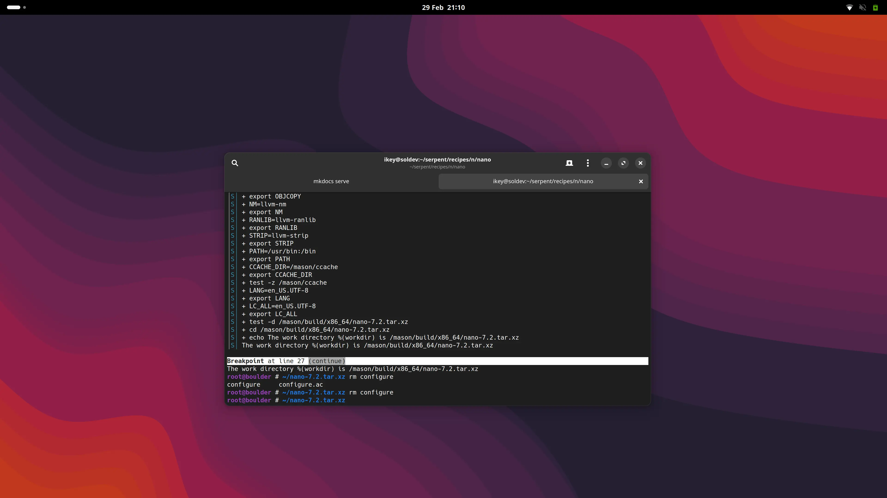

This update came a little later in the month, as we've got a lot of exciting news to share.
Everything from `boulder` in Rust, to the GNOME 45 Desktop complete with `moss triggers` built
atop a rebootstrapped toolchain.

## Rusty Boulder

We're pleased to announce that over the course of this weekend, once testing has completed we'll
deploy the latest version of `boulder`, our packaging build tool. This has been given the Rust treatment,
directly sharing the codebase with `moss`.

<!-- more -->

Unlike our PoC implementation, the new `boulder` makes use of the `clone` syscall to execute portions of
itself under user namespaces, eliminating a longstanding deployment irritation of having the main build binary
inside packaging.

Just like `moss` it makes use of `tokio` for async right where we need it, and is rootless to
make life easier for our contributors. Far from being just a direct port of the proof of concept, it adds
new tools to empower developers, such as **breakpoints in packaging recipes**.

## Triggers, integrated!

After much discussion we finally integrated support for *triggers* in `moss`. These are actions
that are executed at different stages of package management operations to finalize or "bake"
some state based on the unified components of the installation.



In order for triggers to be *useful*, they need to be shipped in packages installed on client machines.
These are easy-to-write `yaml` files that live in either `/usr/share/moss/triggers/sys.d` or within
`/usr/share/moss/triggers/tx.d`, depending on their scope.

<a class="btn btn-primary me-3 mb-4" href="/docs/packaging/recipes/triggers/">
  Learn More <i class="fas fa-arrow-alt-circle-right ms-2"></i>
</a>



Note that right now triggers are re-executed for each transaction, and no caching support is yet in place.
With that said, they're still very fast and we plan to add a store based cache to prevent unnecessary
execution. One of the greatest benefits of our triggers is ensuring these actions run within the right
context under a `namespace`, or container.

## In pursuit of stateless

We've iterated many times over the years our belief in the stateless philosophy, and as a design
decision we mandated that packages can **only** contain `/usr` files. This has meant we've had to
get a bit inventive in shipping working packages out of the box.

One such strategy has been to abolish the reliance on package triggers for system users and groups.
In the past we've relied on `systemd-sysusers` to construct these accounts, such as `gdm`. A downside
is there is no simple way to handle the cleanup of these accounts.

We're now happily using systemd `userdb` user and group drop-in records via `nss-systemd` to provide
the default users + groups (including `users`) group with centrally managed, fixed UIDs and GIDs in our
git recipes.


In order to make management of users easier, we employ a specific systemd mechanism that makes
drop-in user and group records automatically "appear" to applications that use the proper libc APIs.
These are JSON format files that live in `/usr/lib/userdb` and are exposed to applications via `nss`.

<a class="btn btn-primary me-3 mb-4" href="/docs/packaging/recipes/system-accounts/">
  Learn More <i class="fas fa-arrow-alt-circle-right ms-2"></i>
</a>


## GNOME Desktop

Thanks to triggers now being fully integrated in Serpent OS via `moss`, we've actually managed to
package up most of the basic parts of GNOME 45. This includes a functioning GDM, GNOME Shell and
a handful of applications.

## Packaging work

Outside of the heavy work on the tooling and GNOME, we've also been tidying up our recipes repo and
recently performed a fresh rebootstrap using:

 - glibc 2.39
 - binutils 2.42
 - GCC 13.2.0
 - LLVM 17.4.0
 - Rust 1.78.0

Note that our primary toolchain is `glibc`, `lld`, `clang` / `clang++`, `libc++`, `libunwind`, etc.
The majority of packages are built with this LLVM + glibc toolchain, and a subset of packages currently
build with the GNU toolchain due to various wrong assumptions or use of GCC extensions.

Our kernel has always been built with clang.

## Images

Our shortterm plan is to deliver a prealpha image for the general public to test, and to get a "feel" for
Serpent OS and associated tooling. As soon as this is out of the door we will immediately pivot to getting
Serpent OS fully functioning on baremetal, with explicit targets in mind: the hardware that core developers
are currently using.

These images will be available but not promoted for general use - given their intended use as dogfooding systems.
This is part of our shift to the `oxide-alpha-1` target milestone, which will be discussed further in our next post
announcing the prealpha image.

## Next time

Our next monthly blog post should return to its regular slot, with updates on the following topics:

 - Limiting `async` in moss to targeted areas (PR ready and pending review)
 - Life on Serpent: How baremetal testing + enabling is going.

 Until then, please, stay tuned!
