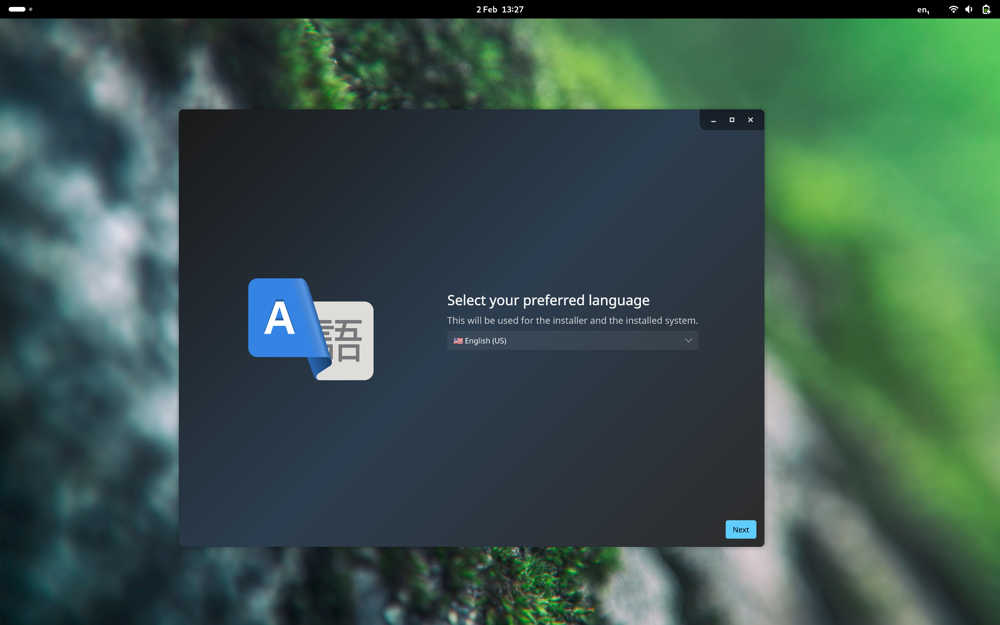

**TL;DR**: Serpent OS is facing funding challenges but development continues. Alpha2 is coming soon with an improved installer. We're seeking community support through donations and volunteers for key roles. Our technical roadmap includes versioned repositories, immutable OS features, and improved package management workflows.

---

We had a flurry of activity around the Christmas period, including our first alpha release as well as
enabling offline rollbacks early in January. We're actively working on alpha2, but we also need to
talk about the elephant in the room.

## 🐘 The elephant in the room

Recently I posted a [tweet](https://x.com/Serpent_OS/status/1886715364744007935) that has been covered
by a few news outlets. The long and short is quite simple: distinct lack of funds. A *very long* story
short: a change in my contract led to a loss of income protection, combined with a herniated disc (C6-C7),
culiminated in having to resign. Naturally I've been working exclusively on Serpent OS since then, but
I've also got to keep the lights on at home.



This doesn't mean the project is closing or anything like that, but it does mean that I actively need to keep
costs down whilst using daytime hours for financing. This is what's led to the significant slowdown in the
last few weeks, and I'm just trying to be as transparent as possible and manage expectations.

### 💼 But couldn't you just get a job?

Sure. The reality is that with a job, and kids, there's very little time left for Serpent OS. I personally
believe very strongly in Serpent OS, and I want to see it succeed. As a truly independent project, we're
in a unique position to do things that other projects can't. We haven't got to answer to shareholders, or
concern ourselves with market share. We can focus on making the best possible OS for our users.

But it's not *just* that. We're building the tools so that others can build *their* vision of the best OS.
Or provide applicances. Or <insert your idea here>. We're building a set of tools and principles to facilitate
innovation and disruption, for projects of any size. We're not just building an OS, we're building a platform.
Bring your own distro, if you will.

My sincere hope is that others also believe in this vision, and can help us get there. It's make or break time,
and you have the power to help us make it.

### 💰 Funding

OK, so how can folks help? The most obvious one is funding, so we'll get that out of the way first. Right now
it's possible to support us via [Ko-fi](https://ko-fi.com/serpentos) or [GitHub Sponsors](https://github.com/sponsors/ikeycode).
For the sake of transparency, as noted on the [Sponsor](/sponsor) page, we haven't got an established company
or business bank account. In time, we're looking towards something more cooperative. For now, the reality is
the daily running and development largely falls on me.

### 🏗️ Infrastructure

One way that we could certainly cut some costs, and improve scaling, is through additional infrastructure.
We're currently hosted on a single Hetzner server, and we're looking to expand that to a more distributed
setup. Rune Morling currently hosts 2 of the builders in his home at his own expense, and the main server
is also the primary builder, which is less than ideal.

We need to split the repository hosting as its grown enormously, and could do with a few more builders to
facilitate "try builds" of pull requests.

Lastly we're looking at CDN solutions to improve the speed of package downloads (efforts currently ongoing).

### 👥 Roles and responsibilities

We're growing quickly and that comes with some pain points. We're looking for immediate help in the following key areas:

- **Community management**: Someone to manage social media, forums, and other community platforms.
- **Documentation**: Once we pivot to Astro + Starship, we'll need to focus on adding high quality documentation.
- **Translation**: We're enabling gettext + fluent where appropriate, and will need extensive translation work.
- **Web development**: We need to improve our web presence, management of web properties, transition to Astro, etc.

While of course we'd also love more developers and packagers, most of the time is spent in these areas already, and the other
roles desperately need attention.

## 🚀 Latest developments

Before we get into the future, let's talk about what we've been working on lately.

### 💾 Disk Management (disks-rs)

A couple of weeks back we broke the news that we were working on a new disk management library, `disks-rs`.
The scope wasn't made quite clear at the time, but it's another building block to facilitate smarter applications.
Eventually we want to support the manipulation of various filesystems and disk structures, for use in CI pipelines, etc.

Another requirement for disk-rs is to not only expose sane partitioning logic, but also to provide a way to declaratively
define disk layouts. This will be used in the installer, but also for reproducing entire installations. It forms the basis
for our future provisioning system.

Right now we're working on a very cool [`.kdl`](https://kdl.dev) based format for defining disk layouts. It takes advantage
of `kdl-rs` streaming parser to implement a procedural syntax complete with miette error handling for a very nice developer
experience:

```kdl
// Create a partition table. Defaults to GPT
create-partition-table type="gpt" disk="root_disk"

// Create the ESP
create-partition disk="root_disk" id="esp" {
    constraints {
        min (GB)1
        max (GB)2
    }
    type ...
}
```

### 🛠️ Installer

Our installer has quite a nice backend, but honestly the frontend experience leaves a lot to be desired. Given that our current
focus is being able to not only onboard developers but build tooling against an installed system, we need to make the core of
this effectively scriptable. To do so will build upon ongoing IPC work for moss and disks-rs, and the introduction of a new GUI
frontend based on [Slint](https://slint.dev/). While early days we're trying to think 10 miles down the road, where we can utilise
the LinuxKMS backend for minimal installer ISOs.

Early preview:




## 🔮 The road to stability

So we have some exploratory works in progress, and it's time to discuss how they all relate to the future of Serpent OS.
You'll immediately notice that these are highly circular in nature, meaning we need to switch between different areas
routinely. In order to design an effective architecture, whilst minimising disruption, we need to have a clear vision
of the future that we're referring to as "10 miles down the road".

### 📚 Versioned repositories

As previously explained, one of the built-in mechanisms to support a rolling release with breaking changes to the format is to introduce
explicitly versioned repositories. Long story short, a local `moss` client will only "see" the latest version of the repository that it can
actually use. Breaking changes will mean format bumps, and newer repository versions will be unavailable until the client has updated to
a client/Serpent OS version that actually supports it.

This work requires changes to the repository format, infrastructure, and a migration path from the current repository to a new
archive. However, it is also dependent on having a new format version being available for the versioned-indices.

### 🔒 Immutable OS

Frequently Serpent OS is described as an immutable OS, but in actuality it is an **atomic** OS. That means we've focused entirely
on providing a reliable update mechanism, rollbacks, etc. We have not yet enforced immutability, aka a read-only root filesystem.

Our plan is heavily inspired by [composefs](https://github.com/containers/composefs). Currently `moss` produces new filesystem trees
using a hardlink farm approach, and relies on `renameat2()` to atomically switch the root filesystem. This is a very fast operation,
but does not provide immutability.

Leveraging the ability of moss to dynamically construct filesystems from packages, it will be abstracted into a driver mechanism. This will
allow the classic hardlink approach for buildroots, but employ a new `erofs` strategy for immutable installs. The newly generated
`erofs` image will essentially rely on extended attributes to "point" to the underlying content addressable storage, and utilise
`overlayfs` to present a read-only view of the filesystem. Further building on this we'll use so-called "mount tucking" to provide
the mechanism for atomic updates without the need for a reboot.

#### 🤔 Why not use composefs?

We're actually going to make moss support exports to composefs format, making it an ideal match for `podman` use cases, deduplicating
the image content. Whereas `composefs` produces content from an existing tree, we've already got content addressable storage, independent
transactions and databases to facilitate this. This means we'll be able to retain our composition features and very quickly produce the
new `erofs` images. Using `composefs` directly would significantly slow down the time to produce each transactions, whereas we can instead
build a similar internal functionality and integrate at higher levels.

We also plan to integrate the file digests in a new revision of the moss `stone` format, which will open the door to supporting
SELinux xattrs, as well as `fsverity` for the immutable images.

Note that this goal will inform the requirements for the next stone format, which will in turn require versioned repositories.
Of course, this also impacts the build pipeline infrastructure.

### 👷 Maintainer burden

Truly the most time consuming task in most distributions is the *cost* of maintaining packages. This is being approached, as with all
of the planned goals, in an incremental fashion. However, it often pays to have a view 10 miles down the road to determine exactly how
to get there.

#### 🧬 ABI Tracking

In order to provide sanity for developers, and make guarantees about the stability of the system, we need to track the binary ABI for
all packages. Furthering on this, we can of course immediately detect any breakage and schedule rebuilds as appropriate. This will also
add a higher degree of confidence for pull requests as we'll know if its consistent or introducing problems.

#### 🔄 Pull Request workflows

The workflow for packaging right now is for someone to open a pull request, which contains their recipes, the automatic "build records" (manifest)
and our assumption that they built it using a local repo based on top of the latest repository. What is actually needed here is for the infrastructure
to perform automatic (low priority) builds of each pull request in a *transient* repository, making those builds available for verification
purposes.

#### ⚛️ Atomic repo merges

Another limitation with the current infrastructure is the reliance on a global build queue. Simply put, once a PR is merged, all of those builds
are scheduled and individually published to the target repository upon completion. This is very naive, and leads to a lot of "nannying" in the
event of a failed merge.

In future, those builds will be scheduled in a transient repository, and upon successful completion the resulting artefacts would be published
to the target repository in a single atomic operation. This will also allow for the introduction of "try builds" for pull requests.

#### 🩸 The bleed-through problem

Another issue which partially relates to bootstraps, is the bleed through problem. This is an artefact of using layered repositories, such as a local
repository, to build updates that would change the providers available in the underlying repository upon merge. Take for example, LLVM.

```
main repo:
    ├── rust [runtime-depends: libLLVM-18.so]
    └── build-dep: binary(rust) [runtime-depends: libLLVM-18.so]

local repo:
    ├── rust [runtime-depends: libLLVM-19.so]
    └── build-dep: binary(rust) [runtime-depends: libLLVM-18.so]
```

After completion of libLLVM-19.so, the local repository would contain the new version, but the main repository would still contain the old version.
Locally this would allow the circular build dependencies to work as `rust` builddep for `rust` could still resolve `libLLVM-18.so`. However, upon,
merging to the repository, we have a new problem. The main repository would now contain `libLLVM-19.so`, but the `rust` package would still be
built against `libLLVM-18.so`. This then breaks the dependency chain for `rust`, requiring manual intervention.

To solve this, we'll ensure that **filtered** repository views are introduced both for local builds and our build infrastructure. This will mean
that the index of the local repository will *occlude* the main repository, and eliminate bleed-through.

#### ⭕ The bootstrap problem

Whilst ABI tracking is very important, it doesn't actually solve the bootstrap problem of circular dependencies. This is a consequence
of using an incremental development model for a binary-first distribution. In reality the only real way to solve this is by eventually
altering the tooling to support a "world view", with intermediate recipes that are not published to the final repository. In effect, combined
with ABI tracking for dependency chain invalidation, we can determine which recipes need to run again as part of an invaldation-solver loop
that relies on "cached artifacts", i.e. the final packages.

This isn't an immediate issue to solve, but it will inform our next steps to ensure we get to that point without requiring extensive
overhauls or "stop the world" rewrites. Our eventual vision is that building any new package will feel much like it does now, but changing a
reverse dependency will evaluate the dependent chain for rebuilds. To make this streamlined, the infrastructure will by this time have
grown to a point where we can share the compute power by way of so-called "try builds", and a shared cache of artifacts.

#### 📦 Keeping the packages up to date

A large portion of the burden is in reality chasing updates. Currently we have a very simplistic utility that cross-references
[release-monitoring.org](https://release-monitoring.org) to spit out a list of recipes that have available updates. Truthfully
we could **easily** generate diffs for these updates, and even automate the process of updating the recipes. This is dependent
however on having confidence in the pull request, which in turn is dependent on ABI tracking being in place.

### 🗂️ Organising it all

We have a complex series of interdependent goals, which require research and frequently shifting between focus areas. Not all of them will be immediately realised,
and some are simply informing the direction for our future. Additionally, we need to keep moving without any "rewrite the world" pauses.

It's important to highlight that none of this is a reinvention of the project, but a series of steps to "1.0" and beyond to ensure that
the project is sustainable and reliable. This means that delivery continues, and the delivery itself becomes simpler and more trustworthy.

Despite the interdependencies, once we've finished scoping the end requirements we can work towards the immediate concerns:

 - Pull request workflow
 - Repository *consistency* (initially ABI story)
 - Update automation
 - Immutability

Note: These timelines are estimates and may adjust based on available resources and community support.
## Scale-up considerations

We're at the point where we need a functional OS for contributors to be able to work on the project. It also presents a paradox because
we wish to keep the project lean whilst we work on extending the scale-out capabilities. In reality this means that we're going to permit
a **limited** amount of repository growth:

 - Addition of the Plasma desktop for daily use
 - Container-management tooling (podman, docker, etc)
 - Development tools (IDEs, etc)
 - Onboarding requirements (such as Matrix clients, documentation, etc)

This in turn also requires a more reliable installation experience, which is why we've been spending cycles on the installer project.
Internally we want the installer to support a variety of scriptable configurations in order to provide better test coverage for our updates
and boot management, whilst we also intend to **incrementally** improve the user experience.

## 📅 Conclusion

Alpha2 is coming, and will feature a preliminary version of the updated installer. The plan initially is for a simple "use whole disk" strategy
and will be followed up with supported for encrypted installations (post alpha2). Quite simply, some employers require their developers have encrypted installs,
and not supporting this configuration will restrict our ability to onboard developers.

We're doing the Alpha2 as a baseline, from which all update testing, infrastructure adjustments, etc, will be measured against. This is the
point at which the project will formally "open the doors" for more developers and testers, with the explicit view that growth is
sustainable and manageable. Per the requirements set above, we're not going to "explode", but enable specific workflows that in turn will permit
us to scale out the project and inform direction.

It's important to me that we're explicit in how we take our next steps. As stated earlier, pausing the world is not an option.
Continued delivery whilst enabling an incremental path to the future is the only way to ensure that we can deliver on our promises.
Contrary to a reboot, this is a solidification of our vision and a commitment to the future. Sure, new features will also appear in time,
such as easier packaging recipe formats, but no decision is being made that will require a rewrite of the project. However, these goals
require stating and explaining up front so that the high level vision is clear and provides the context for any short-term deliverables.
The last thing we need is to be in a position where we're "stuck" and unable to deliver, due to a lack of foresight.

## 🙏 Thank you

On behalf of the project, I'd like to thank everyone who has supported us so far. Whether that's through donations, code contributions,
or even having the time of day to try out the ISO, it's deeply appreciated. Being the underdog comes with its own set of challenges,
and of course the "indie cost", but it's also an opportunity to challenge the status quo and find new, more optimal ways, to do things.

We're not just building "Serpent **OS**", we're building a set of tools to solve the problem of distributing an OS. Way down the line this
will be powerful enough to support a number of use cases, from appliances to desktops, and even servers. In short, we want to bring high
quality tooling to the masses, and we're doing it in a way that's sustainable and reliable.
