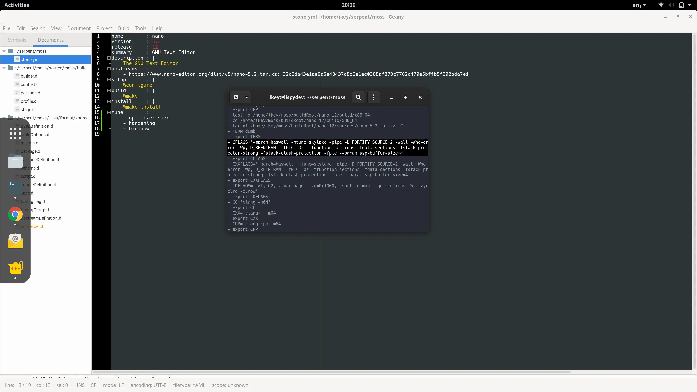

Wow, has it been a hectic few weeks, and it definitely shows: last time
we blogged it was about re-bootstrapping with glibc. Feels like ancient news
already! So, what's new in the world of Serpent OS? Apart from yours truly
now being proud parent to a beautiful baby girl, work has resumed on
the development of Moss, our package manager. And it builds stuff. Awesomely.
Let's quickly catch up with those updates and see where we're headed next.

<!--more-->

# It lives!

We're now able to build **the majority** of a moss package. Notice I've made
a distinction there. So, we're able to run the build instructions, and use
all of the metadata, configuration and macros available. The only thing
we're not actually doing is dumping the built files into a binary package.



We're able to do the build-system part _rather well_, now. Right now
we support the following features in the build system:

 - Multiple, profile-based architecture support
 - Automatic `-m32` profile based cross compilation support for 32-bit libraries on 64-bit OS
 - Basic Profile Guided Optimisation via the `workload` key. Set a workload, optimise accordingly.
 - LLVM Context Sensitive Profile Guided Optimisation. This is default for LLVM with the `workload` key, and comes for free, with multiple build stages.
 - Profile based tuning options, such as `optimize` for speed, size, disabling hardening, etc.
 - Trivially switch between `gnu` and `llvm` toolchain in `stone.yml`, with profiles knowing the right flags to use with tuning options.
 - Recursive macro support in build scripts, defined on per-profile level
 - Architecture specific profiles support in stone.yml, i.e. `profiles -> aarch64 -> setup:` to avoid if/else spaghetti.

# Next on the agenda

Now that the huge amount of scaffolding work has been done, we can actually turn the results of builds
into installable binary packages using our `moss.format.binary` module. We'll add some magic sauce to
have automatic subpackages + inter-package dependencies, along with the expected automatic runtime
dependencies + such. Cue some linting, et voila, build tool that's a pleasure to work with.

Once we have all those packages building, we'll need a way to install them. Luckily some scaffolding
is in place for this already, and it won't take much effort to support `moss install somepkg.stone`.
Then we throw a few dozen packages in the mix, add some dependency handling, repo support, Bob's your
uncle, and your aunt is downloading exclusive early-access images from our [Open Collective](https://opencollective.com/serpent-os) as soon
as they're available. :O