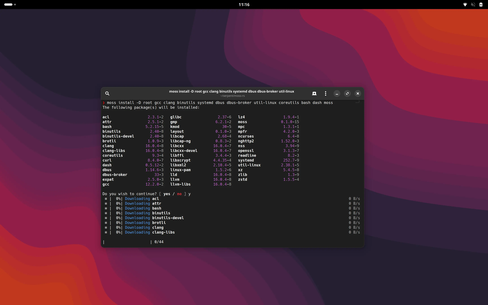

---
hide:
    - navigation
    - footer
title: Home
---

# A new, yet familiar kind of Linux

Serpent OS is a heavily engineering-led effort to redefine the *distribution* aspects of a Linux&reg; distro. Fed up with
an all-or-nothing approach, i.e. classical package management or entirely image based, we set out to create a hybrid approach
that blends the best of both worlds.

[:fontawesome-solid-gift: Sponsor us!](https://github.com/sponsors/ikeycode){ .md-button }

## What is Serpent OS?

Serpent OS is an independent Linux-based operating system built upon a variety of open source technologies. Most importantly,
it is an attempt to provide a **sane** installation that cannot be "broken" by updates. It does this through a variety of
recovery mechanisms, including on-disk offline rollbacks and system deduplication.

We acknowledge that updates can go wrong, despite striving to avoid breakage with our advanced tooling and processes. This
is why we designed with recovery in mind - reboot to the last transaction, be confident with package triggers that run in
isolated containers.

## Who is Serpent OS for?

Anyone. Whether you're a downstream, building containers or just enjoying Serpent OS itself for the simplicity of maintenance,
there's something for everyone.

As a project, we care deeply about **how things work** - so our primary goal is to improve the automation and tooling used
by our developers and contributors to streamline delivery of features and updates to our users.

!!! danger "Serpent OS is in active, heavy development"

    We welcome all contributions at this stage of our development, as we transition from prototypes to deliverables,
    especially with our transition to Rust. With the integration of system triggers nearing, we'll begin to publish
    frequent desktop ISOs and OCI images for dog-fooding purposes.

## Meet the tools

We said we care deeply - and this is made a reality through our tooling. Whether it's package builds, orchestration of updates,
or the package manager itself, each component is crafted with care and extensive experience and is fully open source.

### :rocket: moss - blazing fast package management

Whether you're using Linux for home or work, we've got you covered. Don't wait around for old package managers
or bundles; turbocharge your installations and containers with [moss](https://github.com/serpent-os/moss-rs) and Serpent OS.

#### :atom: Atomic transactions

Every package management operation creates an entirely self contained transaction, offering rollbacks to earlier points in
time as well as ensuring new updates are safe to apply. Unlike other "A/B" transaction systems, `moss` can make the new
system root available immediately.

#### :zap: Ridiculously fast

We leverage the fastest technologies and techniques to provide *ridiculously* fast package management.

 - [xxHash](https://xxhash.com) for content addressable hashes. Zip!
 - [Zstandard](https://github.com/facebook/zstd) for package compression, kernel modules, firmware, etc.
 - Upcoming: [BLAKE3](https://github.com/BLAKE3-team/BLAKE3) for verification!
 
#### :lock: Safer

 - :crab: Core tooling is written in Rust, with support tooling in the process of being ported. Memory safe with extremely fast execution.
 - :warning: Self-contained builds of essential system tools - moss can recover your system if you accidentally remove glibc!

### :hammer: boulder: A better way to package

We've been building tools to build systems for a long time and came to an obvious conclusion: Packaging is, by and large,
a set of *policies* applied to the final build artifacts of compliant source packages.

#### :superhero: Superpowered packaging

Our simple yet powerful `stone.yml` format makes it a breeze to create packages for Serpent OS. Whip them through [boulder](/boulder), our
container-based build tool, and have binary packages in no time.

No steep learning curve, just some YAML and an extremely intelligent package build system capable of automatically splitting packages into
the correct subpackages and recording their dependencies. Heck, we can even generate a recipe from an upstream release! :astonished:
